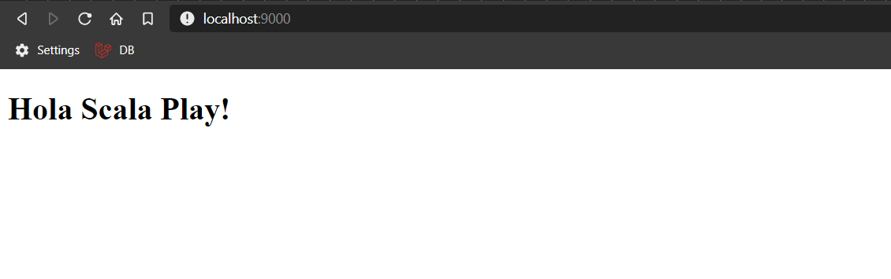
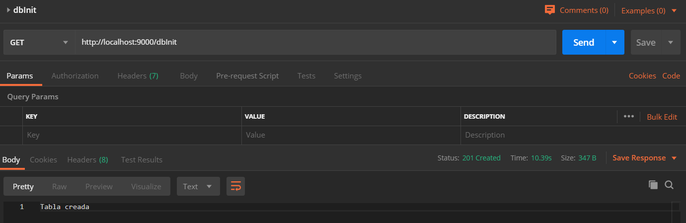
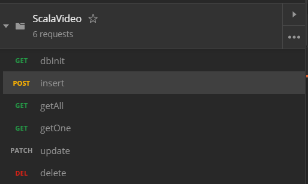
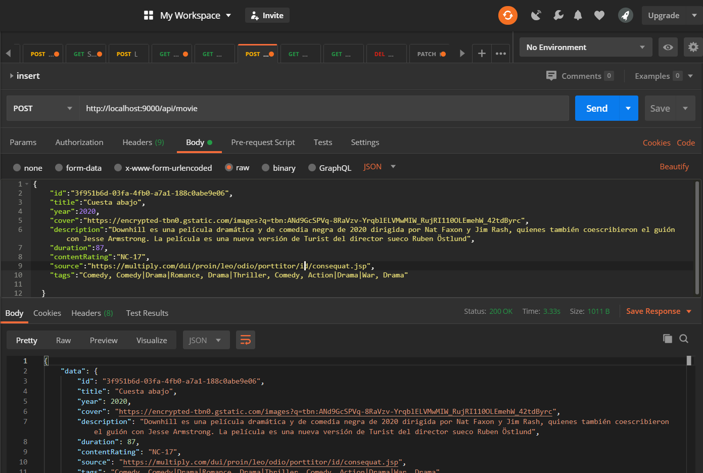

# Api de Peliculas con Scala Play <!-- omit in toc -->

App de peliculas con scala, el repositorio contine información teórica además del proyecto 

## Tabla de Contenido<!-- omit in toc -->
- [Descripción del proyecto](#descripci%c3%b3n-del-proyecto)
  - [Requerimientos](#requerimientos)
  - [Correr el proyecto](#correr-el-proyecto)
    - [Probar la API](#probar-la-api)
- [Información de interés sobre Play Scala](#informaci%c3%b3n-de-inter%c3%a9s-sobre-play-scala)
  - [Documentación de Slick](#documentaci%c3%b3n-de-slick)
  - [Procesamiento paralelo](#procesamiento-paralelo)
  - [Asincrono](#asincrono)
  - [Concurrencia](#concurrencia)
  - [Serialización](#serializaci%c3%b3n)
- [Exportar a producción SBT](#exportar-a-producci%c3%b3n-sbt)
  - [Preparación de la exportación](#preparaci%c3%b3n-de-la-exportaci%c3%b3n)
  - [Zip a producción](#zip-a-producci%c3%b3n)
  - [Código compilado a una carpeta](#c%c3%b3digo-compilado-a-una-carpeta)
  - [Ejecución en modo producción](#ejecuci%c3%b3n-en-modo-producci%c3%b3n)
  - [Docker](#docker)

# Descripción del proyecto
API Rest de peliculas (CRUD) creada con el framework Play para Scala

## Requerimientos

[Scala](https://www.scala-lang.org/). Lenguaje que corre sobre la Maquina Virtual de Java (JVM)

[SBT](https://www.scala-sbt.org/) El gestor de dependencias de Scala. SBT búsca sus dependencia en Maven y a su vez este los búsca en https://mvnrepository.com/ donde son administrados por múltiples empresas a diferencia de NPM

[Play Framework](https://www.playframework.com/) Funciona para Java y Scala ya que son retrocompatibles

[Template Lightbend download](https://developer.lightbend.com/start/?group=play&project=play-scala-seed)
Descargar el proyecto base de lightbend

[Postman](https://www.postman.com/) Prueba la API de forma rápida

## Correr el proyecto

El proyecto tiene una colección para postman, llamada: ``ScalaVideo.postaman_collection.json`` dentro del repositorio en el que puedes ejecutar el proyecto

```bash
sbt update
sbt compile
sbt run
```

Por defecto se ejecuta en:
http://localhost:9000

<div align="center">
  
  <small><p>Servidor ejecutandose</p></small>
</div>

### Probar la API
Usar el postman incluido

Iniciar la base de datos creada en SQLite
<div align="center">
  
  <small><p>Api</p></small>
</div>

<div align="center">
  
  <small><p>Contenido de la colección</p></small>
</div>

<div align="center">
  
  <small><p>Ajecución de la API</p></small>
</div>

# Información de interés sobre Play Scala
## Documentación de Slick
https://scala-slick.org/doc/3.3.1/supported-databases.html
https://scala-slick.org/doc/3.3.1/schemas.html
https://www.playframework.com/documentation/2.7.x/PlaySlick

## Procesamiento paralelo
https://github.com/scala/scala-parallel-collections
https://docs.scala-lang.org/overviews/parallel-collections/overview.html

## Asincrono
https://docs.oracle.com/javase/8/docs/api/java/util/concurrent/Executor.html#java.util.concurrent.Executor
https://www.playframework.com/documentation/2.7.x/ThreadPools

## Concurrencia
Akka Framework
ZIO Library

## Serialización
Convierte datos y objetos en objetos json
https://github.com/xdotai/play-json-extensions

# Exportar a producción SBT

## Preparación de la exportación
````bash
sbt
playUpdateSecret
````

## Zip a producción
target/universal
````bash
sbt dist
````

## Código compilado a una carpeta
Genera el código en target/universal/stage
````bash
sbt stage 
````

## Ejecución en modo producción
```bash
start # Deprecated
runProd # Equivalente
```

## Docker 
[Plugin para Scala](https://www.scala-sbt.org/sbt-native-packager/index.html)

Crea una imagen Docker lista para probar
````bash
sbt docker:publishLocal
````
Creará una imagen con el nombre del proyecto

Para ejecutar en docker:
```bash
docker run -p 9000:9000 -it scalap-play-api:1.0-SNAPSHOT
```